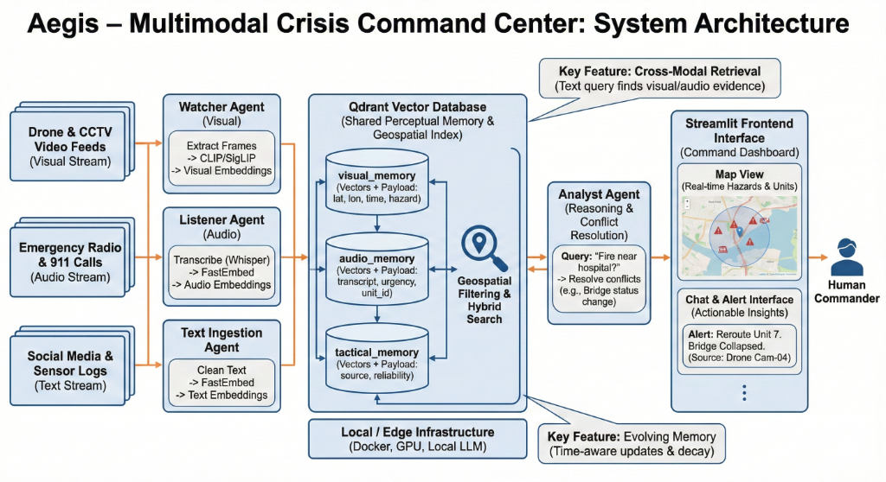

# 🛡️ Aegis – Multimodal Crisis Command Center

**Aegis** is an AI-powered Situation Awareness system designed for crisis management. It fuses data from **Video, Image, Audio, and Text** sources into a unified vector database to provide real-time intelligence, semantic search, and grounded analytical reasoning.



## 🚀 Features

### 1. Multimodal Ingestion Agents
*   **🎥 Watcher Agent (`watcher_agent.py`)**: Monitors video feeds via YOLO-World for hazard detection and CLIP for frame indexing.
*   **🖼️ Image Agent (`image_agent.py`)**: Processes static imagery with OCR and geospatial tagging.
*   **🎙️ Listener Agent (`listener_agent.py`)**: Transcribes radio/audio logs with automated MP3-to-WAV conversion and geocoding.
*   **📄 Text Agent (`text_agent.py`)**: Ingests social media snippets and tactical SITREPs.

### 2. Intelligent Core (Advanced Agentic Framework)
*   **🧠 Strategic Retrieval & Tool Use**: Agents actively *choose* when to search vs. answer directly. Includes the **Explicit Planner Agent** (`planner_agent.py`) for decomposing complex multi-step queries.
*   **🔍 Critic Agent (`critic_agent.py`)**: Self-correction module that checks for hallucinations, verifies citations, and enforces safety warnings.
*   **⏳ Episodic Memory (`episodic_memory.py`)**: Stores interaction summaries to enable contextual recall (e.g., resolving "Is *it* safe there?" based on previous turns).
*   **🛡️ Autonomous Verification (`analyst_agent.py`)**: Background agent that autonomously cross-validates visual hazards with audio intelligence before issuing alerts.
*   **Advanced Memory Manager (`memory_manager.py`)**: Centralized lifecycle for embeddings, including TTL-based eviction and confidence scoring.
*   **Robust LLM Manager (`llm_manager.py`)**: Multi-model fallback system (Llama-3.3-70B → Mixtral → Llama-3.1-8B) to ensure 100% uptime even during rate limits.
*   **Retrieval Provenance (`retrieval_logger.py`)**: Full traceability of every AI response, logging queries, retrieved evidence IDs, and confidence scores.

### 3. Command Dashboard
*   **📍 Crisis Operational Map**: Real-time visualization of hazards, civilians, and field data.
*   **🔍 Semantic Search**: Multi-modal search with high-precision keyword filtering.
*   **💬 Safety AI Chat**: Agentic chat interface with **Confidence Badges** and "Plan Execution" visualization.
*   **⚡ Zero-Latency Alerts**: Verified alerts from the Autonomous Analyst Agent.

---

## 🏗️ Architecture & Memory Model

- **Vector Database**: Qdrant Cloud (Managed)
- **Embedding Models**: 
  - `BAAI/bge-small-en-v1.5` (Text/Audio - 384d)
  - `Qdrant/clip-ViT-B-32-text` (Visual - 512d)
- **Reasoning Engine**: Groq (Llama-3.3-70B)
- **Object Detection**: YOLO-World (Open-Vocabulary)

For a deep dive into the system design, see [ARCHITECTURE.md](docs/ARCHITECTURE.md).

---

## 🛠️ Setup & Installation

See [SETUP.md](SETUP.md) for detailed environment configuration and execution instructions.

### Quick Start (Environment)
1. Install requirements: `pip install -r requirements.txt`
2. Configure `.env`:
   ```ini
   QDRANT_URL=https://your-cluster.qdrant.io
   QDRANT_API_KEY=your-api-key
   GROQ_API_KEY=your-groq-key
   ```

---

## 🧪 Evaluation & Performance

Aegis includes a built-in evaluation harness to measure system accuracy and responsiveness.

**Run Benchmarks:**
```bash
python tests/benchmark.py
```
*   **Metrics tracked**: Precision@k, Recall@k, Latency (ms), and Throughput (QPS).
*   **Provenance**: View `retrieval_logs.json` for detailed RAG audit trails.

---

## 📂 Project Structure

*   `docs/`: Detailed system documentation and reports.
*   `tests/`: Evaluation benchmarks and test suites.
*   `_inbox/`: Hot-folders for real-time data ingestion.
*   `memory_manager.py`: Core memory lifecycle logic.
*   `retrieval_logger.py`: RAG traceability and provenance.

## 🧠 AI Stack Rationale

| Component | Choice | Rationale |
| :--- | :--- | :--- |
| **Embeddings** | FastEmbed | Low-latency local CPU inference. |
| **Search** | Qdrant | Hybrid filtering (Vector + Metadata + Keywords). |
| **Reasoning** | Groq/Llama | Ultra-fast inference for real-time tactical advice. |
| **Geospatial** | Nominatim | Accurate city/state level coordinate extraction. |
