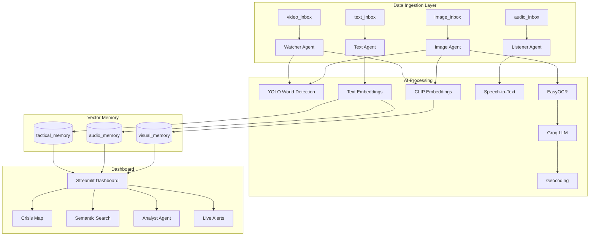

# Aegis: Multimodal Crisis Command Center - Architecture

## 1. System Overview

Aegis is a multimodal crisis intelligence platform that ingests visual, audio, and textual data streams, extracts disaster signals using AI, and provides real-time situational awareness through an interactive dashboard.



---

## 2. Memory Architecture

### Collections

| Collection | Dimension | Content | Retention |
|------------|-----------|---------|-----------|
| `visual_memory` | 512 (CLIP) | Images, Video Frames | Permanent |
| `audio_memory` | 384 (BGE) | Audio Transcripts | Permanent |
| `tactical_memory` | 384 (BGE) | Text Reports, Social | Permanent |
| `session_memory` | 384 (BGE) | Working Memory | Session-based |

### Payload Schema

```json
{
  "source": "filename.png",
  "modality": "image|video|audio|text",
  "timestamp": "2026-01-20T19:00:00Z",
  "disaster_type": "flood|fire|cyclone|...",
  "confidence": 0.85,
  "location": {"lat": 13.08, "lon": 80.27, "name": "Chennai"},
  "content": "Extracted text or transcript",
  "revision": 1
}
```

---

## 3. Retrieval Pipeline

### RAG Flow

1. **Query Embedding**: Convert user query to vector (CLIP for visual, BGE for text)
2. **Vector Search**: Query all collections with score threshold (0.60)
3. **Keyword Filtering**: Match location keywords for accuracy
4. **Evidence Formatting**: Format top-k results with citations
5. **LLM Grounding**: Prompt with explicit citation instructions
6. **Provenance Logging**: Log query, retrieved IDs, response

### Hybrid Search Strategy

- **Dense Vectors**: CLIP (512d) for visual, BGE (384d) for text
- **Payload Filters**: disaster_type, confidence, timestamp, modality
- **Keyword Matching**: Post-filter for location accuracy

---

## 4. Agent Architecture

| Agent | Input | Processing | Output |
|-------|-------|------------|--------|
| Image Agent | PNG/JPG | YOLO + CLIP + OCR + LLM → Geocode | Visual Memory |
| Watcher Agent | MP4/AVI | YOLO + CLIP + OCR (frames) | Visual Memory |
| Listener Agent | WAV/MP3 | Speech-to-Text + LLM → Geocode | Audio Memory |
| Text Agent | TXT/JSON | Text Embedding + LLM → Geocode | Tactical Memory |
| Analyst Agent | User Query | RAG + LLM Reasoning | Chat Response |

---

## 5. Evaluation Metrics

### Retrieval Quality
- **Precision@K**: Relevant results in top-K
- **Recall@K**: Coverage of all relevant items
- **MRR**: Mean Reciprocal Rank

### System Performance
- **Query Latency**: Target < 500ms
- **Throughput**: Queries per second
- **Index Time**: Time to process new data

### Run Benchmark
```bash
python tests/benchmark.py
```

---

## 6. Privacy & Ethics

### Data Handling
- No PII collection by default (optional redaction module planned)
- Location data aggregated to city level
- Retention policy: 24h for session, permanent for indexed

### Bias Considerations
- YOLO trained on general objects, may miss region-specific hazards
- Geocoding depends on OSM coverage
- LLM may hallucinate if evidence insufficient

### Mitigation
- Explicit LLM grounding with citation requirements
- Confidence thresholds for alerts
- Human-in-the-loop for critical decisions

---

## 7. Deployment

### Local Development
```bash
# Install dependencies
pip install -r requirements.txt

# Start agents
python image_agent.py
python watcher_agent.py
python listener_agent.py
python text_agent.py

# Start dashboard
streamlit run dashboard.py
```

### Environment Variables
```env
QDRANT_URL=https://xxx.qdrant.io
QDRANT_API_KEY=xxx
GROQ_API_KEY=xxx
```

---

## 8. Limitations

1. **Network Dependency**: Requires Qdrant Cloud and Groq API connectivity
2. **GPU Recommended**: OCR and CLIP faster with GPU
3. **Language**: Currently English-only for OCR and STT
4. **Scale**: Tested for demo scale (~1000 points)

---

## 9. Future Roadmap

- [ ] Sparse + Dense hybrid search (BM25)
- [ ] PII redaction module
- [ ] Multi-language support
- [ ] Edge deployment mode
- [ ] Real-time streaming ingestion
